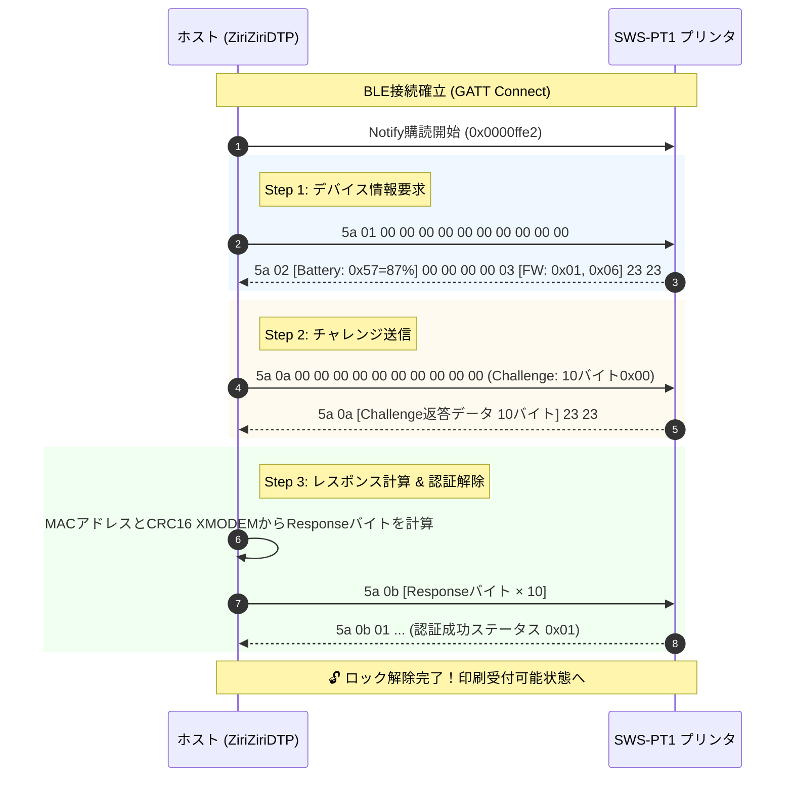
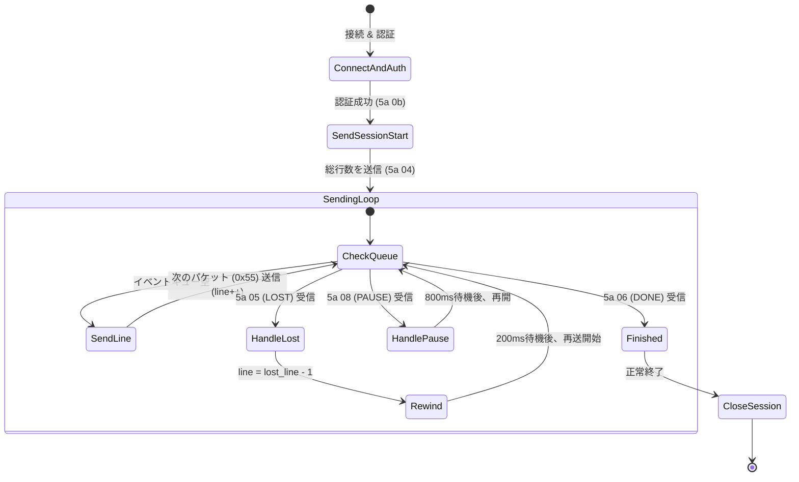
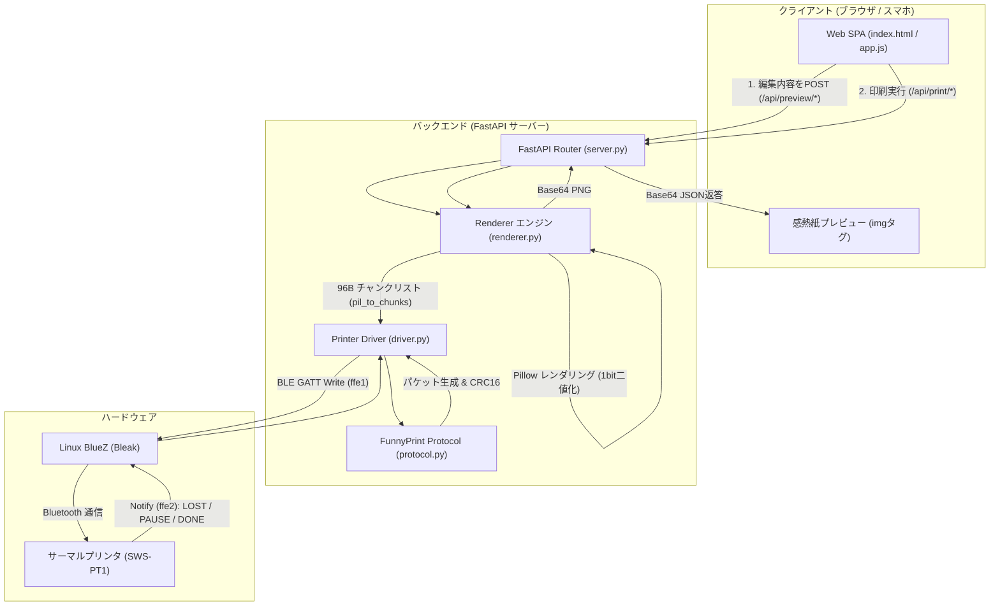

# SWS-PT1 (Funny Print系列) 技術仕様 & リバースエンジニアリング記録

本ドキュメントは、ポータブルサーマルプリンタ「**SWS-PT1**」を Linux 上で独自制御するにあたり、リバースエンジニアリングによって判明した通信プロトコル、認証ハンドシェイク、フロー制御、および開発初期のハマりどころを後続の開発者やAIアシスタント向けにまとめた技術ドキュメントです。

---

## 📌 目次
1. [初期のハマりどころ（一般的な感熱プリンタとの違い）](#1-初期のハマりどころ一般的な感熱プリンタとの違い)
2. [BLE GATT サービス・キャラクタリスティック仕様](#2-ble-gatt-サービスキャラクタリスティック仕様)
3. [認証ハンドシェイクの全貌 (Challenge & Response)](#3-認証ハンドシェイクの全貌-challenge--response)
4. [印刷データパケット構造 (Raster Packet)](#4-印刷データパケット構造-raster-packet)
5. [フロー制御ステートマシン (バッファ溢れ・巻き戻し再送)](#5-フロー制御ステートマシン-バッファ溢れ巻き戻し再送)
6. [全体データフローアーキテクチャ](#6-全体データフローアーキテクチャ)
7. [実装上の重要Tips・注意点](#7-実装上の重要tips注意点)

---

## 1. 初期のハマりどころ（一般的な感熱プリンタとの違い）

### ❌ 誤算: ESC/POS や Cat-Printer のコマンドが全く通らない
一般に市販されている安価なポータブル感熱プリンタ（58mm幅）の多くは、以下のいずれかの規格に準拠しています：
1. **標準 ESC/POS コマンド** (`0x1b 0x40` 初期化、`0x1b 0x2a` ビットマップ印刷など)
2. **Cat-Printer / GB01 系プロトコル** (`0x51 0x78` マジックバイトで始まるパケット)

しかし、本機「SWS-PT1」にこれらのパケットを送信しても、**プリンタは完全に沈黙し、一切動作しませんでした**。

### 🔍 正体の解明: Shenzhen Xiqi / DOLEWA 社「Funny Print」系統
BLE アドバタイズ情報およびスマートフォン推奨アプリを調査した結果、本機は中国 **Shenzhen Xiqi Technology / DOLEWA** 社系統の「**Funny Print**」アプリ専用ハードウェアであることが判明しました。

この系統のプリンタには以下の独自仕様が存在します：
- パケットヘッダとして `0x5A`（制御系）および `0x55`（ラスタデータ系）を使用する。
- **BLE接続直後に「認証ハンドシェイク」を完了させないと、一切の印刷コマンドを受け付けない（セキュリティロック機構）**。
- プリンタ内部の受信バッファが小さく、パケット欠落をホスト側へ通知して巻き戻しを要求する「双方向フロー制御」が必須。

---

## 2. BLE GATT サービス・キャラクタリスティック仕様

SWS-PT1 の通信ポートは、標準のプリンタプロファイルではなくカスタムGATTサービスを使用します。

| 項目 | UUID | 用途 |
| :--- | :--- | :--- |
| **Service** | `0000ffe6-0000-1000-8000-00805f9b34fb` | Funny Print メインサービス |
| **Write Char** | `0000ffe1-0000-1000-8000-00805f9b34fb` | ホスト → プリンタへのコマンド・データ送信 (`Write Without Response`) |
| **Notify Char** | `0000ffe2-0000-1000-8000-00805f9b34fb` | プリンタ → ホストへの状態通知・フロー制御通知 (`Notify`) |

> **注意**: `Write Char` は応答なし書き込み (`write_gatt_char(..., response=False)`) で送信する必要があります。応答あり書き込みを行うとタイムアウトエラーになります。

---

## 3. 認証ハンドシェイクの全貌 (Challenge & Response)

接続後、直ちに印刷データを送っても無視されます。ホスト側は以下の3ステップのハンドシェイクを実施してロックを解除する必要があります。

### シーケンス図



### レスポンスバイトの算出アルゴリズム

レスポンスは、チャレンジの先頭バイトとプリンタの BLE MAC アドレス（バイナリ6バイト）を連結したデータに対して **CRC-16 XMODEM** を計算し、その上位バイトを取り出します。

```python
import binascii

def crc16_xmodem(data: bytes) -> int:
    """CRC-16 (XMODEM: 多項式 0x1021, 初期値 0x0000)"""
    crc = 0
    for b in data:
        for i in range(8):
            bit = (b >> (7 - i)) & 1
            c15 = (crc >> 15) & 1
            crc = (crc << 1) & 0xFFFF
            if c15 ^ bit:
                crc ^= 0x1021
    return crc

# MACアドレス: "AA:BB:CC:DE:04:EF" -> b"\xaa\xbb\xcc\xde\x04\xef"
mac_bytes = binascii.unhexlify(mac.replace(":", ""))
payload = b"\x00" + mac_bytes  # Challenge先頭(0x00) + MAC 6バイト = 計7バイト
response_byte = (crc16_xmodem(payload) >> 8) & 0xFF

# 送信パケット: 0x5a 0x0b + response_byte * 10
packet_response = b"\x5a\x0b" + bytes([response_byte]) * 10
```

---

## 4. 印刷データパケット構造 (Raster Packet)

SWS-PT1 は **横幅 384ドット**（48バイト）固定のサーマルヘッドを持っています。
Funny Print プロトコルの最大の特徴は、**1つのデータパケットに2行分（2ラスタライン）のデータを格納する** 点です。

### 1パケットのフォーマット (計100バイト)

| オフセット | 長さ | 内容 | 説明 |
| :--- | :--- | :--- | :--- |
| `0x00` | 1 byte | `0x55` | 印刷行データマジックバイト |
| `0x01 - 0x02` | 2 bytes | 行番号 (`line_no`) | 0から始まる Big-Endian 16bit 整数 |
| `0x03 - 0x32` | 48 bytes | 上ラインラスタ | 384ドット分（1ドット=1ビット、黒=1、白=0） |
| `0x33 - 0x62` | 48 bytes | 下ラインラスタ | 384ドット分（1ドット=1ビット、黒=1、白=0） |
| `0x63` | 1 byte | `0x00` | パケットフッター（チェックサム/固定値） |

> **⚠️ 偶数ライン数（2の倍数）の制約**:
> 1パケットが必ず2ライン単位で構成されるため、画像の高さ（総ライン数）は **必ず偶数** でなければなりません。奇数ラインの画像を送ると、最後の1行が壊れたり、次ジョブの先頭にゴミとなって現れます。

---

## 5. フロー制御ステートマシン (バッファ溢れ・巻き戻し再送)

### 開発初期の問題: 「画像を送ると途中で止まり、ブラウザがグルグルする」
単なるテキスト数十行程度であれば一気にパケットを送信しても通ることがありますが、長文や高密度の画像データ（150パケット以上）を連続送信すると、プリンタ側のBLE受信バッファが溢れ、パケットドロップが発生します。

このときプリンタは Notify キャラクタリスティック (`0000ffe2`) 経由でステータス通知を送ってきます。これらを監視し、状態に応じたハンドリングを行わなければ印刷を完遂できません。

### プリンタからの通知パケット一覧

| 先頭バイト | パケット長 | 意味 | ホスト側の処理 |
| :--- | :--- | :--- | :--- |
| `0x5A 0x05` | 4 bytes | **LOST (パケット欠落・バッファ満杯)** | 続く2バイト (`lost_line`) を読み取り、**`lost_line - 1` まで送信インデックスを巻き戻して再送** する。少しウェイト (0.2s) を置く。 |
| `0x5A 0x08` | 3 bytes | **PAUSE (一時停止要求)** | ヘッド過熱防止やバッファ消費待ち。送信ループを一時停止し、クールダウン (0.8s) する。 |
| `0x5A 0x06` | 3 bytes | **FINISHED (印刷完了)** | プリンタが全ラインの物理印字を完了した合図。ジョブを終了処理へ進める。 |

### フロー制御ステートマシン図



このステートマシン（`ziriziri/driver.py` 内 `print_chunks` メソッド）を導入したことにより、どんなに大きな画像や長いレシートでも途中で止まることなく 100% 確実に最後まで印刷できるようになりました。

---

## 6. 全体データフローアーキテクチャ

システム全体の構成と、ユーザーがブラウザで操作してから紙が出力されるまでのデータフローです。



---

## 7. 実装上の重要Tips・注意点

1. **排他制御 (`asyncio.Lock`)**:
   複数のタブやスマホから同時に印刷リクエストが飛ぶと、BLE接続が衝突して切断されます。`PrinterDriver` 内で必ず `asyncio.Lock` を保持し、1つのプリントジョブまたはステータス確認ジョブが完了するまで次のジョブを待機させてください。
2. **自動電源オフ対策**:
   SWS-PT1 は数分間放置されるとバッテリー節約のため自動的にスリープ（電源OFF）になります。印刷前にプリンタの電源ランプが点灯（緑または青）していることを確認してください。
3. **物理排出口とカッター位置のオフセット**:
   サーマルプリントヘッドの位置から、本体上部のギザギザ刃（排出口）までは物理的に約 15mm（120ドット相当）離れています。最後の文字やキリトリ線がヘッド位置で止まると手で切れないため、印刷ジョブの末尾に白紙ライン（`feed_after`）を送り出す必要があります。
4. **フォントの太字（Bold）処理**:
   感熱プリンタの解像度は 203 DPI であり、小さなフォントは線が細すぎると白くかすれます。視認性を重視する場合は、フォントの `stroke_width=1` や太字ウェイトの TrueType フォントを使用するのが効果的です。
